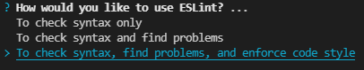
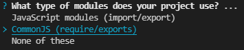
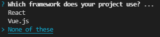
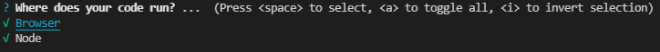
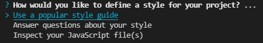
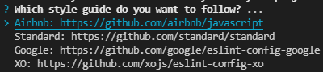
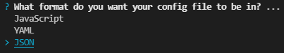
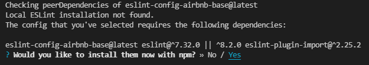

# Eslint-integration-guide

## Step 1

Install **ESlint** and **Prettier** extantions in VScode.  

## Step 2  

Open the terminal and enter the following commands `npx eslint --init`, this will only work if you have the ESlint extension installed.  
Then you'll need to answer the questions in the terminal:  
<br>

  
Recommended: pick the third option.  

<br>

  
Tip: CommonJS works fine with both backend and frontend.  

<br>

  
Here just pick none if you don't use React or Vue.js.  

<br>

  
Here just pick no if you don't use TypeScript.  

<br>

  
Recommended: press 'a' to choose all. (didn't see any difference and it covers everything)  

<br>

  
Here choose 'Use a popular style guide'.  

<br>

  
Here you need to choose your preferred style guide. (airbnb is recommended)  

<br>

  
Recommended: choose JSON. (I found it the easiest to work with)  

<br>

  
Choose yes and it will install everything you need.  

## Step 3

Now that the `.eslintrc.json` file was added it will look like that:  
```
{
    "env": {
        "browser": true,
        "commonjs": true,
        "es2021": true,
        "node": true
    },
    "extends": [
        "airbnb-base"
    ],
    "parserOptions": {
        "ecmaVersion": 13
    },
    "rules": {
    }
}
```
You need to change the `"ecmaVersion"` to 12 so the file will look like this:  
```
{
    "env": {
        "browser": true,
        "commonjs": true,
        "es2021": true,
        "node": true
    },
    "extends": [
        "airbnb-base"
    ],
    "parserOptions": {
        "ecmaVersion": 12
    },
    "rules": {
    }
}
```
Now everything should work just fine, if it does not work yet try to restart the ESlint server (`ctrl + shift + p` -> ESlint: Restart ESlint server).

## Step 4 

Now that the eslint Style guide works we can integrate Prettier too.  
If you followed step 1 then you have Prettier extension installed, now you can type the following commend in the terminal: `npm i --save-dev  eslint-config-prettier`.  

Now you can add the `.prettierrc` file, this holds the rules that prettier will follow to format your code.  
The basic configuration looks like this:  
```
{
    "semi": true,
    "singleQuote": true,
    "tabWidth": 2,
    "useTabs": false,
    "trailingComma": "es5"
}
```
Now let's add prettier to the "extends" array in your `.eslintrc.json` file. Make sure to put it last, so it gets the chance to override other configs. 
Your `.eslintrc.json` file should look like this:  
```
{
    "env": {
        "browser": true,
        "commonjs": true,
        "es2021": true,
        "node": true
    },
    "extends": [
        "airbnb-base",
        "prettier"
    ],
    "parserOptions": {
        "ecmaVersion": 12
    },
    "rules": {
    }
}
``` 

**That's it now you have eslint and prettier integrated**  

### P.S
If you want to make prettier to **format on save** I recommend the following guide: https://www.robinwieruch.de/how-to-use-prettier-vscode